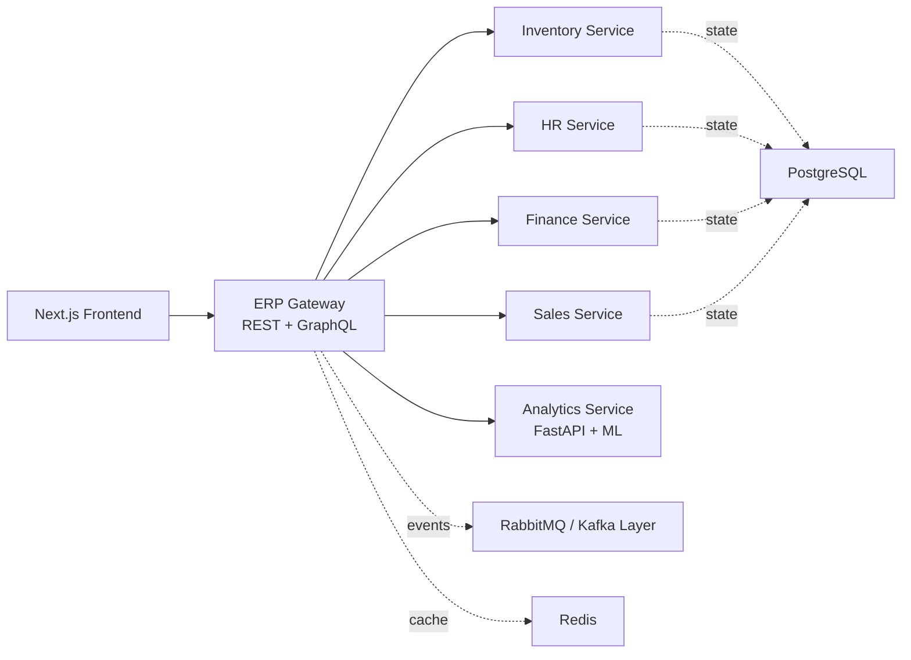
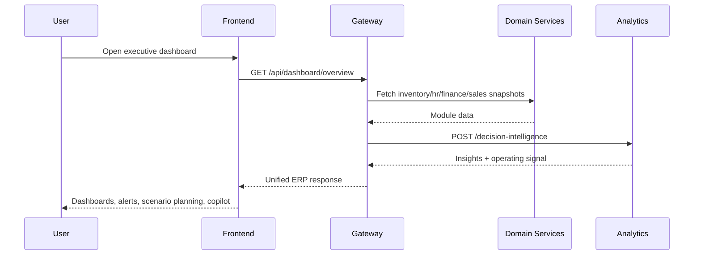

# Intelligent ERP System

An enterprise-grade, fully web-based ERP platform with a polished executive UI, modular service boundaries, AI-assisted decision support, and deployment tooling for local or Kubernetes-based environments.

## Highlights

- Full web experience in `Next.js` with premium dashboard styling
- REST and GraphQL gateway APIs
- Domain services for Inventory, HR, Finance, and Sales
- FastAPI analytics service for forecasting and decision intelligence
- JWT auth, RBAC, audit logging, and realtime notification streaming
- Docker Compose and Kubernetes manifests for scalable deployment

## Monorepo Layout

```text
erp-system/
├── frontend/
├── backend/
├── services/
│   ├── inventory-service/
│   ├── hr-service/
│   ├── finance-service/
│   ├── sales-service/
│   └── analytics-service/
├── ml-models/
├── docs/
├── k8s/
├── docker-compose.yml
└── README.md
```

## Quick Start

### One-command startup

```bash
./run-erp.sh
```

The launcher will:

- install Node.js dependencies per workspace
- create a local Python virtual environment
- install analytics dependencies
- validate builds
- stop anything already using the ERP ports
- start the full stack and wait for health checks

To stop everything:

```bash
./run-erp.sh --stop
```

### Local development

```bash
npm install
pip3 install -r services/analytics-service/requirements.txt
npm run dev
```

The frontend runs at [http://localhost:3000](http://localhost:3000) and uses a seeded admin login automatically when the backend is available.

### Containerized stack

```bash
docker compose up --build
```

## Demo Credentials

- `admin@northstar.com` / `password123`
- `manager@northstar.com` / `password123`
- `employee@northstar.com` / `password123`

## Architecture Diagram



## Data Flow Diagram



## ML Model Explanation

The analytics layer uses a hybrid approach:

- Regression models estimate next-step sales and inventory demand trends.
- Rule-based scoring interprets attrition risk, margin pressure, and cross-functional dependencies.
- Scenario simulation projects revenue, expense, margin, and headcount outcomes from executive inputs.
- The business copilot transforms current ERP state into natural-language answers and follow-up recommendations.

See [ml-models/README.md](ml-models/README.md) and [architecture.md](docs/architecture.md) for more detail.

## Business Impact Explanation

- Sales growth can automatically drive hiring recommendations before operations become a bottleneck.
- Inventory risk can surface supplier prioritization actions before fulfillment rates drop.
- Finance signals can identify margin-protection opportunities instead of relying on month-end surprises.
- HR attrition exposure can directly influence sales planning and workforce resilience decisions.
- Executives get one command center rather than fragmented departmental dashboards.

## API Overview

- REST: dashboard aggregation, module snapshots, notifications, audit logs, scenario simulation, copilot
- GraphQL: unified dashboard and module queries for flexible clients
- Analytics: ML-focused forecasting and hybrid decision intelligence endpoints

Detailed API contracts live in [api-spec.md](docs/api-spec.md).

## Notes

- The current code ships with seeded in-memory data so the platform is runnable immediately.
- The deployment shape already anticipates PostgreSQL, Redis, and RabbitMQ-backed production hardening.
- Multi-tenant support begins with tenant-aware payloads and can be extended with schema or row-level isolation.
# Enterprise-Management-System
